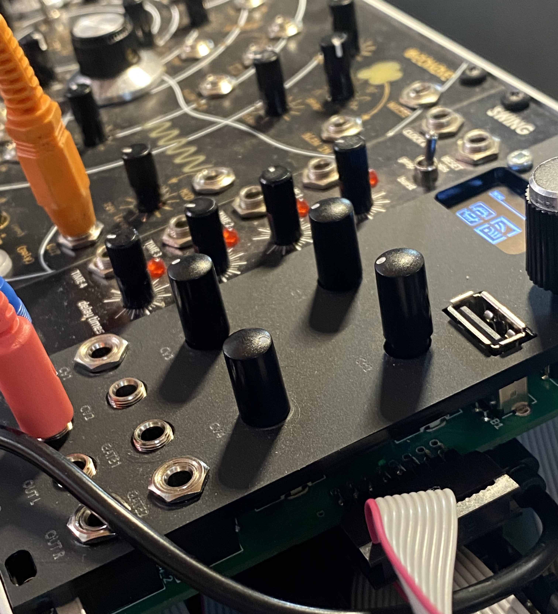

# RPI_module_-eowave-
range of open source synth based on raspberry pi  and pure data

### module : 
- audio codec: 
- audio jacks: 3.5mm stereo in/out
- OLED: 
- CV/gate : 2 CV input, 2 gate input
- USB : one in the front panel
- 4x potentiometers, 1x rotary encoders (wth switch), 1x button

see the full [BOM on Octopart](https://)

### desktop : 
- audio codec: 
- audio jacks: 3.5mm stereo in/out
- OLED: NHD-2.7-12864WDW3
- CV/gate : 2 CV input, 2 gate input
- USB : one in the front panel
- 4x continuous encoders (wth switch), 1x rotary encoders (wth switch), 1x button

see the full [BOM on Octopart](https://)

see [facebook group](https://) for discussion.

[eowave](https://www.instagram.com/eowave_modular/)

## assembly

not explained here

## setting up

get [this os installer from rpi os website](https://www.raspberrypi.com/software/).
launch the software, choose Raspberry PI os Lite (32 bit) then go on the wheel, and enter your wifi SSID and password also, pls click on the ssh box to activate it. Now click on write. 

The first time you launch your module you'll have to set up the environment. So depending on your device (module or desktop), download the corresponding file. Inside is a script.sh which will install all the prerequisite packages for you. it should take 20/25 min.

## file manager

to access the file manager, verify that your module is correctly connected to the wifi by checking the 📶 (wifi) menu. 
then in your browser, simply type the ip adress and you should see all the patches preinstall, then you can use that interface to add new patches, sounds or preset files.

## troubleshooting

if you have trouble accessing wifi or connection problem, you can branch a monitor to the hdmi output of the rpi, then a terminal should appear. Type sudo raspi-config, then System Option, Wireless Lan and re-enter your SSID and passcode.

## notes

## mechanicals
